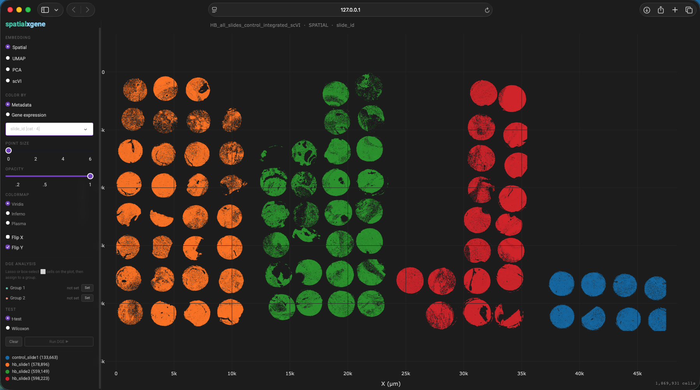
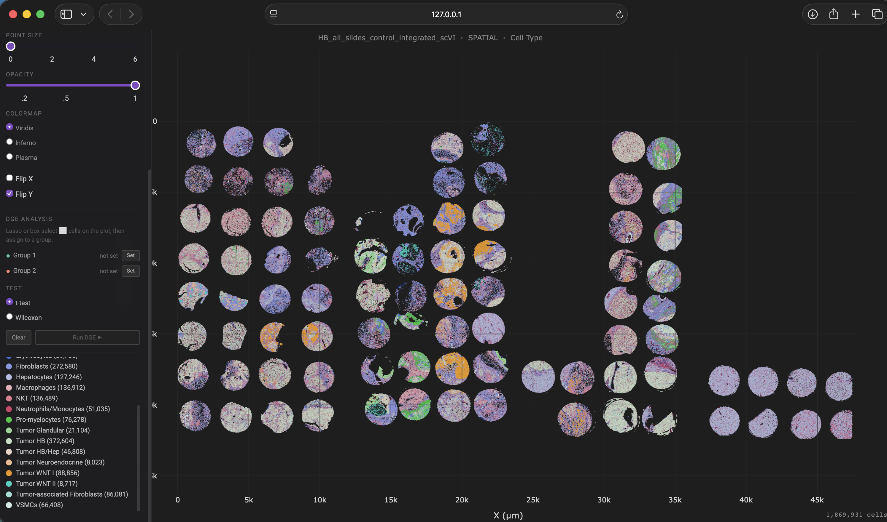
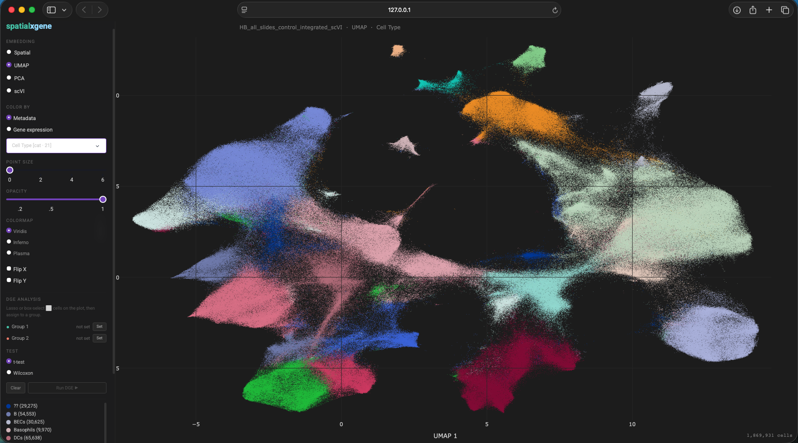

# spatialxgene

[](https://github.com/murti-abhishek/spatialxgene/actions/workflows/ci.yml)
[](https://codecov.io/gh/murti-abhishek/spatialxgene)

Interactive spatial transcriptomics viewer for `.h5ad` files — like CellXGene but with spatial coordinates, UMAP, PCA, and scVI embeddings. Includes manual cell selection and differential gene expression (DGE).

Tools like the Xenium Explorer are great during active analysis but are limited to a single slide and cannot load `.h5ad` files produced by downstream pipelines. `spatialxgene` fills that gap: it reads any `.h5ad` directly, renders spatial coordinates alongside computed embeddings, and scales to multi-slide datasets where coordinates from several Xenium runs have been stitched into a shared space.

## Gallery

<div align="center">



*Four Xenium slides stitched into a virtual TMA, colored by slide ID — 1,869,931 cells.*



*Same view colored by cell type, revealing tissue architecture across all slides simultaneously.*



*UMAP embedding of the same dataset, colored by cell type.*

</div>

## Features

- Visualize spatial, UMAP, PCA, and scVI embeddings — auto-detected from any `.h5ad`
- Color cells by categorical or continuous metadata, or by gene expression
- Datashader-powered rendering for smooth zoom/pan on datasets up to ~2M cells
- Point size and opacity controls
- Flip X / Flip Y axes independently per view
- **Multi-library auto-layout**: when a dataset contains multiple library sections (e.g. Visium HD, Xenium multi-capture) stored under a `library_id`, `sample`, or `batch` column, spatialxgene detects overlapping bounding boxes and automatically shifts each section into a non-overlapping grid — no manual coordinate stitching required
- **Hover tooltips**: hover over any cell to see its current Color By value and barcode; toggled via a sidebar checkbox that defaults on for datasets ≤ 100k cells and off for larger ones to avoid browser overhead
- Lasso/box selection for manual cell group definition
- Differential gene expression between two user-defined groups (Welch t-test or Wilcoxon)
- BH-corrected p-values; results table with CSV export
- DGE history with per-run summaries in the sidebar
- Dark theme UI

## Installation

```bash
git clone https://github.com/murti-abhishek/spatialxgene
cd spatialxgene
pip install -e .
```

## Usage

```bash
spatialxgene launch my_data.h5ad
```

### Options

```
spatialxgene launch --help

Arguments:
  H5AD_FILE  Path to the .h5ad file.

Options:
  --host TEXT          Host to bind.  [default: 127.0.0.1]
  --port INTEGER       Preferred port (auto-increments if busy).  [default: 8050]
  --subsample N        Randomly subsample to N cells (speeds up large datasets).
  --seed INTEGER       Random seed for subsampling.  [default: 42]
  --debug              Run Dash in debug mode.
  --skip-columns COLS  Comma-separated column names to hide from the Color By dropdown.
```

### Example

```bash
# Full dataset
spatialxgene launch HB_slide_1_scVI_v2.h5ad

# Subsample for faster startup
spatialxgene launch HB_slide_1_scVI_v2.h5ad --subsample 100000

# Hide noisy metadata columns
spatialxgene launch data.h5ad --skip-columns "doublet_score,S_score,G2M_score"
```

## Requirements

- Python >= 3.9
- h5ad files produced by Scanpy, AnnData, or compatible pipelines

Spatial coordinates are read from, in order of preference:
- `obsm['spatial']`
- `obs` column pairs: `center_x`/`center_y`, `x_centroid`/`y_centroid`, `spatial_x`/`spatial_y`, `x`/`y`

Additional embeddings (`X_umap`, `X_pca`, `X_scVI`, or any 2-D `obsm` array) are auto-detected and offered as views if present.

## License

MIT
